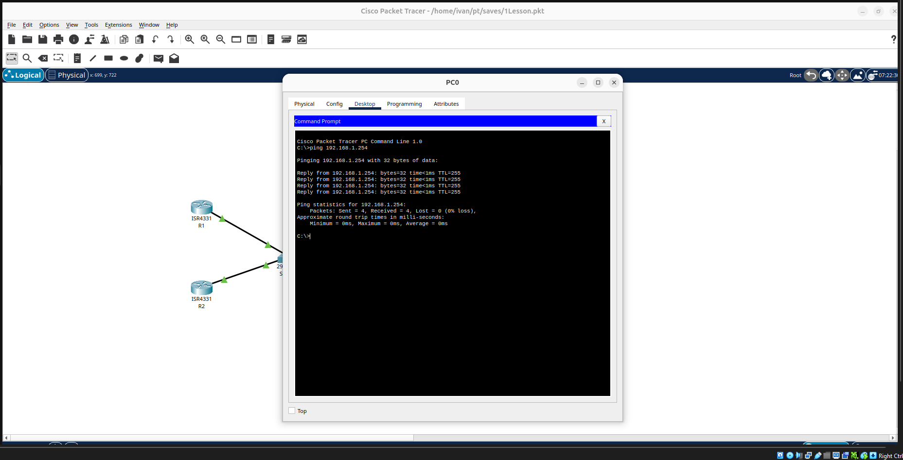
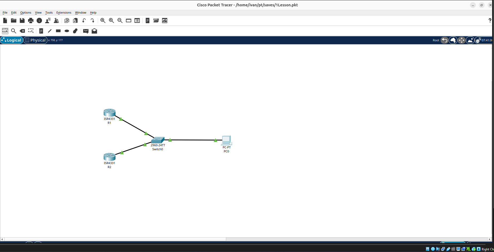
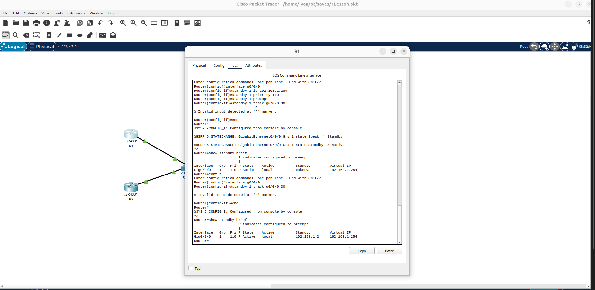
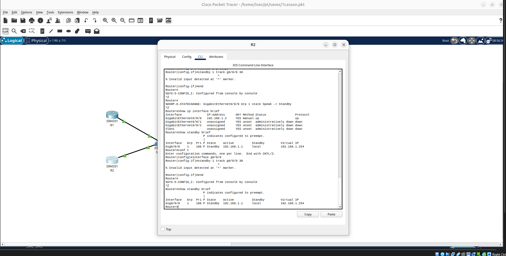

# Домашнее задание: Настройка HSRP в Cisco Packet Tracer — Иван Чернобровкин

## Задание 1

Дана схема для Cisco Packet Tracer, рассмотренная на лекции.  
По схеме уже настроено отслеживание интерфейсов маршрутизаторов Gi0/1 (для нулевой группы).  
Необходимо настроить отслеживание состояния интерфейсов Gi0/0 (для первой группы).  

Для проверки правильности настроек разорвите один из соединений между одним из маршрутизаторов и Switch0 и запустите ping между PC0 и Server0.  

Отправьте полученную схему в формате .pkt и скриншот, где виден процесс настройки маршрутизатора.

## Инструкция по выполнению домашнего задания

В рамках работы была выполнена настройка отказоустойчивой сети с использованием протокола HSRP в Cisco Packet Tracer.

## Цель работы

Настроить резервирование шлюза по умолчанию с использованием HSRP между двумя маршрутизаторами.

## Топология сети

Использованы устройства:
- PC-PT (PC0)
- Switch 2960-24TT
- Router R1
- Router R2

Схема:
PC → Switch → R1
PC → Switch → R2

## IP-адресация

R1: 192.168.1.1 /24  
R2: 192.168.1.2 /24  
Virtual Gateway (HSRP): 192.168.1.254

## Настройка HSRP

R1:
- Priority: 110
- Preempt: enabled
- Virtual IP: 192.168.1.254
- State: Active

R2:
- Priority: 100
- Preempt: enabled
- Virtual IP: 192.168.1.254
- State: Standby

## Проверка работы

Команда:
show standby brief

Результат:
R1: Active  
R2: Standby  

Команда:
ping 192.168.1.254

Результат:
0% packet loss, связь успешна

## Скриншоты

### 1. Ping проверка

### 2. Топология сети

### 3. R2 настройка

### 4. R1 настройка

## Вывод

В ходе работы была настроена отказоустойчивая сеть с использованием HSRP. Виртуальный IP обеспечивает непрерывный доступ к шлюзу при отказе одного из маршрутизаторов.
